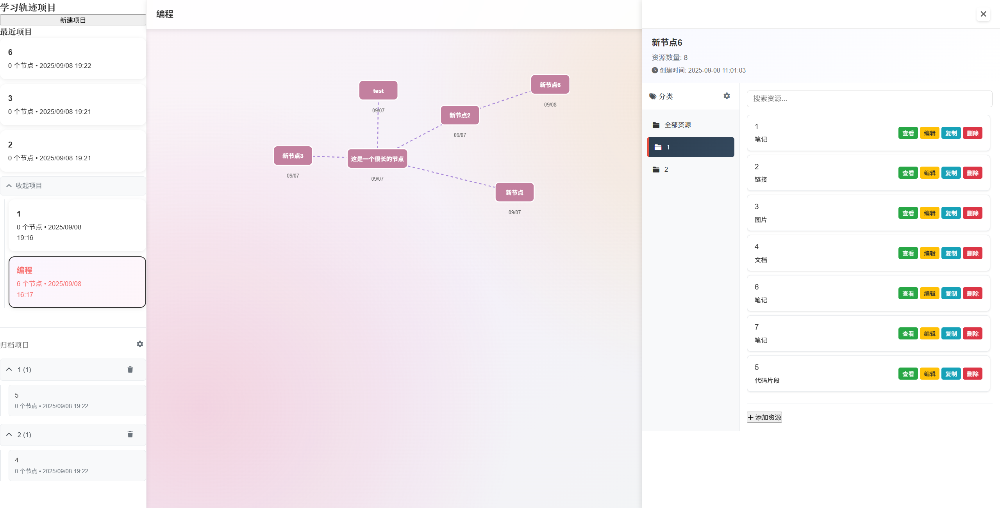

# 学习轨迹图管理系统

> 智能学习轨迹图管理系统 - 支持多项目管理、节点连接、资源管理和项目归档的可视化学习工具

## 🌟 项目简介

学习轨迹图管理系统是一个功能强大的可视化学习工具，帮助用户创建、管理和跟踪学习进度。通过直观的节点连接和丰富的资源管理功能，让学习过程更加系统化和可视化。

## 🚀 在线演示

**GitHub Pages访问地址：** https://15236702150master.github.io/learning-pathway-v2/

## ✨ 核心功能

### 📊 项目管理
- **多项目支持**：创建和管理多个学习项目
- **项目归档**：支持项目完成后的分类归档
- **归档分类管理**：自定义归档分类，支持增删改操作
- **项目切换**：快速切换不同学习项目

### 🎯 节点系统
- **节点创建**：点击画布创建学习节点
- **节点连接**：拖拽创建节点间的学习路径
- **重要标记**：右键标记重要节点（红色显示）
- **时间记录**：自动记录节点创建时间

### 📚 资源管理
- **多类型资源**：支持链接、笔记、图片、文档、代码片段
- **树状结构**：资源支持最多10层的子资源嵌套
- **文件上传**：本地文件上传和预览功能
- **资源操作**：查看、编辑、复制、删除资源

### 🖱️ 画布交互
- **自由拖拽**：拖拽移动节点和画布
- **滚轮滚动**：鼠标滚轮上下滚动画布
- **缩放功能**：Ctrl + 鼠标滚轮缩放画布（0.3x - 3.0x）
- **智能布局**：自动防止节点重叠

### 💾 数据管理
- **本地存储**：使用localStorage持久化数据
- **自动保存**：实时保存用户操作
- **数据导出**：支持学习路径的文本格式导出

## 🛠️ 技术栈

- **前端框架**：纯JavaScript (ES6+)
- **样式**：CSS3 + Font Awesome图标
- **存储**：localStorage本地存储
- **图形**：SVG绘制节点和连接线
- **兼容性**：现代浏览器（Chrome、Firefox、Safari、Edge）

## 📱 功能截图



## 🎮 使用说明

### 基础操作

1. **创建项目**
   - 点击左侧"新建项目"按钮
   - 输入项目名称并确认

2. **添加节点**
   - 在画布空白处点击创建新节点
   - 输入节点标题和描述

3. **连接节点**
   - 从源节点拖拽到目标节点创建连接
   - 右键点击连接线可删除连接

4. **管理资源**
   - **双击节点**打开右侧资源管理面板
   - 支持链接、笔记、图片、文档、代码片段
   - 可创建子资源形成树状结构
   - **拖拽侧边栏边缘**可调整面板宽度

### 🔧 界面操作技巧

1. **侧边栏操作**
   - **双击任意节点**：打开/关闭右侧资源管理面板
   - **拖拽面板边缘**：左右调整侧边栏宽度（最小300px，最大800px）
   - **点击面板外区域**：关闭侧边栏

2. **节点操作**
   - **单击节点**：选中节点（高亮显示）
   - **双击节点**：打开资源管理面板
   - **右键节点**：标记为重要节点（红色显示）
   - **拖拽节点**：移动节点位置
   - **从节点拖拽到其他节点**：创建连接线

3. **画布操作**
   - **鼠标滚轮**：上下滚动画布
   - **Ctrl + 滚轮**：缩放画布（0.3x - 3.0x）
   - **拖拽空白区域**：平移画布视图
   - **点击空白区域**：取消节点选中状态

### 高级功能

1. **项目归档**
   - 项目完成后点击归档按钮
   - 选择归档分类或创建新分类
   - 归档项目可随时取消归档或删除

2. **快捷键**
   - `Ctrl + S`：手动保存
   - `Delete`：删除选中节点
   - `Escape`：取消当前操作

### ⚠️ 重要提醒

1. **首次使用必读**
   - **双击节点**才能打开资源管理侧边栏，单击只是选中节点
   - 侧边栏可以通过**拖拽边缘**调整宽度，适应不同屏幕尺寸
   - 点击侧边栏外的任意区域可以关闭面板

2. **常见操作误区**
   - ❌ 单击节点后找不到资源面板 → ✅ 需要双击节点
   - ❌ 侧边栏太窄看不清内容 → ✅ 拖拽右边缘调整宽度

3. **性能优化建议**
   - 建议单个项目节点数量控制在50个以内，保证流畅体验
   - 大量资源建议使用子资源功能进行分层管理
   - 定期使用项目归档功能整理完成的学习项目

## 🚀 本地运行

### 方法一：直接打开
1. 下载项目文件到本地
2. 用浏览器直接打开 `index.html` 文件

### 方法二：本地服务器
```bash
# 使用Python启动本地服务器
cd learning-pathway-v2
python -m http.server 8000

# 或使用Node.js
npx serve .

# 然后在浏览器访问 http://localhost:8000
```

## 📂 项目结构

```
learning-pathway-v2/
├── index.html          # 主页面文件
├── script.js           # 核心JavaScript逻辑
├── styles.css          # 样式文件
├── sample.png          # 示例截图
├── .gitignore         # Git忽略文件
└── README.md          # 项目说明文档
```

## 🔧 核心模块

### 项目管理器 (ProjectManager)
- 项目CRUD操作
- 项目切换和状态管理
- 数据持久化

### 节点管理器 (NodeManager)
- 节点创建和渲染
- 节点拖拽和交互
- 连接线管理

### 资源管理器 (ResourceManager)
- 多类型资源支持
- 文件上传处理
- 资源树状结构

### 画布管理器 (CanvasManager)
- SVG画布渲染
- 缩放和平移
- 事件处理

### 归档管理器 (ArchiveManager)
- 项目归档功能
- 分类管理
- 归档状态切换

## 🌈 特色亮点

1. **直观可视化**：通过节点和连接线清晰展示学习路径
2. **丰富资源**：支持多种资源类型，满足不同学习需求
3. **灵活管理**：项目归档和分类管理，保持界面整洁
4. **流畅交互**：画布缩放、滚动等交互功能提升用户体验
5. **数据安全**：本地存储确保数据隐私和离线可用

## 🤝 贡献指南

欢迎提交Issue和Pull Request来改进项目！

1. Fork本项目
2. 创建功能分支 (`git checkout -b feature/AmazingFeature`)
3. 提交更改 (`git commit -m 'Add some AmazingFeature'`)
4. 推送到分支 (`git push origin feature/AmazingFeature`)
5. 创建Pull Request

## 📄 开源协议

本项目采用 MIT 协议，详情请参阅 LICENSE 文件。

## 📞 联系方式

- GitHub: [@15236702150master](https://github.com/15236702150master)
- 项目地址: [learning-pathway-v2](https://github.com/15236702150master/learning-pathway-v2)

---

⭐ 如果这个项目对你有帮助，请给个Star支持一下！

## 🔮 未来扩展计划

### 即将推出的功能
- **协作功能**：多人实时协作编辑学习路径
- **模板系统**：预设学习路径模板（编程、语言学习、技能提升等）
- **进度追踪**：学习进度统计和可视化图表
- **标签系统**：为节点添加标签，支持标签筛选和搜索
- **导入导出**：支持从其他平台导入学习数据，导出为多种格式

### 技术优化方向
- **性能提升**：大规模节点的渲染优化和虚拟化
- **移动端适配**：响应式设计和触屏操作优化
- **离线支持**：PWA支持，完全离线使用
- **数据同步**：云端数据同步和备份功能
- **插件系统**：开放API，支持第三方插件扩展

### 社区贡献欢迎
- **UI/UX设计**：界面美化和用户体验优化
- **功能建议**：提出新功能需求和改进建议
- **代码贡献**：修复bug、添加新功能
- **文档完善**：使用指南、API文档、最佳实践
- **测试反馈**：使用体验反馈和问题报告

### 扩展集成可能性
- **笔记应用**：与Notion、Obsidian等笔记工具集成
- **任务管理**：与Todoist、Trello等任务管理工具联动
- **学习平台**：与在线课程平台（Coursera、edX等）数据同步
- **知识图谱**：构建个人知识图谱和智能推荐
- **AI助手**：集成AI学习建议和路径优化

## 📊 使用统计与反馈

如果你正在使用这个项目，欢迎通过以下方式分享你的体验：
- **GitHub Issues**：报告bug或提出功能建议
- **GitHub Discussions**：分享使用心得和最佳实践
- **Star项目**：如果觉得有用，请给项目点个星
- **Fork贡献**：欢迎提交Pull Request改进项目
